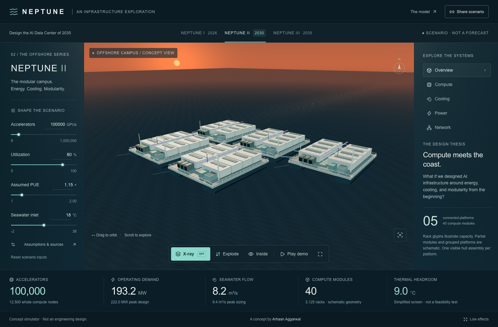

# NEPTUNE

**Design the AI Data Center of 2035** — an interactive 3D offshore AI infrastructure concept by **Arhaan Aggarwal**.

[Open NEPTUNE](https://arhaan2.github.io/neptune-2035/) · [Source repository](https://github.com/Arhaan2/neptune-2035) · [Release record](docs/RELEASE.md)

What would AI infrastructure look like if we designed it around energy, cooling, and modularity from the beginning?

Explore a procedural sunset campus, open X-ray, trace separate cooling circuits and external power, explode six system groups, enter a representative rack aisle, and compare three scenario generations. Controls and geometry share a deterministic TypeScript engineering model. Links reconstruct all scenario inputs. A 30-second real-app storyboard supports presentation and recording.



**Concept simulator · Not an engineering design.** No live telemetry, future GPU product claims, naval certification, or implied free electricity. Read [the model](docs/MODEL.md) for assumptions and omissions.

## Run locally

Node 22.13+ and npm:

```sh
npm ci
npm run dev
```

Open the Local URL printed by Vite (normally http://127.0.0.1:5173/). Drag/touch to orbit, scroll/pinch to zoom, or focus the canvas and use arrow keys and +/−. Reset restores the exterior frame. Escape exits the interior or cancels the demo. The labeled HTML system and scene controls provide equivalent selection.

```sh
npm run typecheck
npm run lint
npm test
npm run build
npm run test:browser
```

Browser tests need Playwright's Chromium, Firefox and WebKit installations; install missing browsers with `npx playwright install`. The browser suite starts or reuses the local dev server. Use `NEPTUNE_BASE_URL` for a hosted or production-preview URL.

## Architecture

- `src/domain`: pure simulation, validated inputs, declared capacity, presets and primary sources.
- `src/state`: bounded schema-v1 scenario URLs.
- `src/scene`: canonical layout, shared instanced geometry, six reversible exploded groups, linked flow anchors, ocean, camera and WebGL fallback.
- `src/ui`: scenario controls, real model outputs, inspectors, assumptions, sharing and demo state.
- `tests`: 53 model/sharing tests and actual-browser acceptance with screenshot comparisons.
- `docs`: model explanation, build log, QA, launch drafts and recording instructions.

Static Vite/React 19 application with Three.js, React Three Fiber 9 and Drei. No backend, database, login, telemetry, live data, paid APIs or essential remote assets. Geometry and the ocean/sky are procedural. A local source registry is bundled. Fonts use the system stack; icons use the installed Lucide library and controls compose the Sites starter's Shadcn/Base UI primitives.

WebGL2 initialization failure or context loss produces an accessible schematic with working model controls. Use `?fallback=1` to inspect it deliberately. Reduced motion stops visual interpolation and flow/ocean animation. Low effects disables shadows and limits resolution. Hidden tabs pause rendering and cancel scripted demos.

## Release and evidence

See [QA](docs/QA.md), [launch drafts](docs/LINKEDIN_LAUNCH.md), and [recording notes](docs/DEMO.md). Generated recordings and full browser traces stay out of Git. Selected screenshots and the social card come from the actual app.

## Scope

The budget builder, free-roaming controls, additional cooling architectures, glTF/Blender/Unreal exports and WebGPU are deferred. Costs, training speed and model capability are intentionally not inferred from accelerator count.
