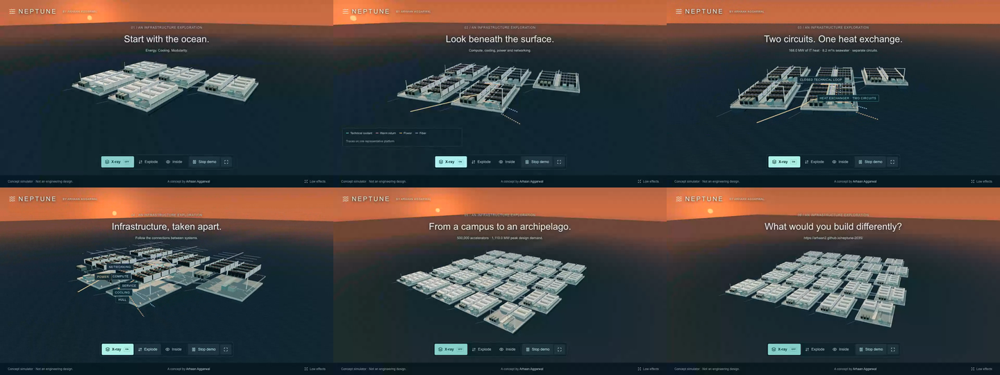

# Demo and recording

The **Play demo** control uses actual application scenario state, selection, shell visibility, exploded transforms and cameras. It can be stopped, restarted, or canceled by manual interaction or Escape. Completion/cancellation returns to the original scenario with a defined exterior view. Hidden tabs cancel the demo. Reduced-motion users see state changes without camera orbit or animated interpolation.

Storyboard: 0–5 s exterior; 5–10 s X-ray; 10–15 s cooling; 15–20 s six system groups exploded; 20–26 s generation III; 26–30 s closing question and actual current URL. Dates are labels, not forecasts. Captions show real model quantities.

Use **Presentation mode** for a clean 16:9 or 4:5 composition. The NEPTUNE identity and concept qualifier remain visible. The ordinary interface is also recordable with metrics and inspector text.

To reproduce the automated capture, start the app and run:

```sh
NEPTUNE_RECORD=1 npm run test:browser -- --project=chromium tests/browser/record.spec.ts
```

This writes a real 1280×720 WebM to `assets/demo/neptune-demo.webm`, plus cinematic and 800×1000 presentation screenshots. Local recording writes the actual-page social preview to `public/social-preview.png`. When `NEPTUNE_BASE_URL` is set, the hosted hero goes to `assets/screenshots/hosted-presentation-16x9.png` so recording does not modify the deployed social card. `assets/demo/capture.json` records the URL and actual demo start offset.

Manual recording: open the release URL; choose Presentation mode; set the window to 1280×720 or 800×1000; start your system screen recorder; select Play demo; keep the page foreground for 30 seconds; stop the recording. Do not crop out the concept qualifier. Press Escape or Stop demo to cancel and reset.

MP4 production uses a local FFmpeg encoder after checking the actual WebM recording. The system Xcode toolchain could not initialize for native encoding; it is not required to run or record NEPTUNE. The temporary FFmpeg executable is not redistributed. Exact transcoding and playback verification are recorded in QA.

## Delivered recording

The accepted hosted capture used a 3.272-second setup trim. Its resulting MP4 was decoded completely and played/searched in Chromium; six decoded frames were inspected. It is 30 seconds, 1280×720, 25 fps H.264, with no audio. [Download the release assets](https://github.com/Arhaan2/neptune-2035/releases/tag/v0.1.0).

With a local FFmpeg that supports libx264, the executed encoding options are reproducible as:

```sh
ffmpeg -ss 3.272 -i assets/demo/neptune-demo.webm -t 30 -c:v libx264 -preset medium -crf 18 -pix_fmt yuv420p -movflags +faststart -an assets/demo/neptune-demo.mp4
ffmpeg -v error -i assets/demo/neptune-demo.mp4 -f null -
node scripts/verify-video.mjs
```

For a new capture, use its own `demoOffsetSeconds` from `capture.json`. The verifier serves only the local video and an inspection page on an ephemeral loopback port, checks playback/metadata, and saves six decoded frame captures and `verification.json`. Use the actual generated paths; the recordings are excluded from Git.


